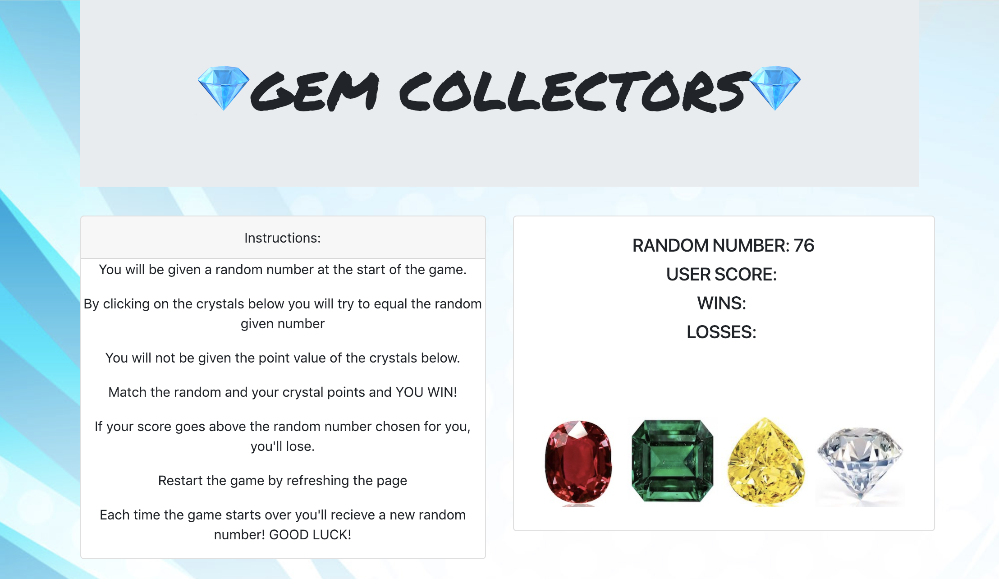

#  Gem Collector
**Title:** Crystal Collector
**Developer:** Kayla Verheyen 
**Date:** 09-27-18
**For:** Northwestern Coding Bootcamp
**Published:** https://kaylaverheyen.github.io/unit-4-game/
**Built Using:** Javascript, HTML, CSS, & JQuery

## Sumary: 
This game: Crystal Collector, gives the user an opportunity to *click* on the crystals to get an unknown number of **points** to try and equal the random number generated once the webpage loads. The user will use the gems to attempt to equal the random number! 

### User Guide
1. Read instructions 
2. Check out your random number 
3. Click a crystal (**TIP***Pay attention to how many your running score increases by to keep track of the pointage of each crystal*)
4. Repeat step 3 until you get close to the random number 
5. If you equal your total score to the random nuymber, you've won the game! Considered the gems collected!!!!
6. If your total score becomes higher than the random number you will not collect those crystals. :(
7. Reload the page to try again! 

